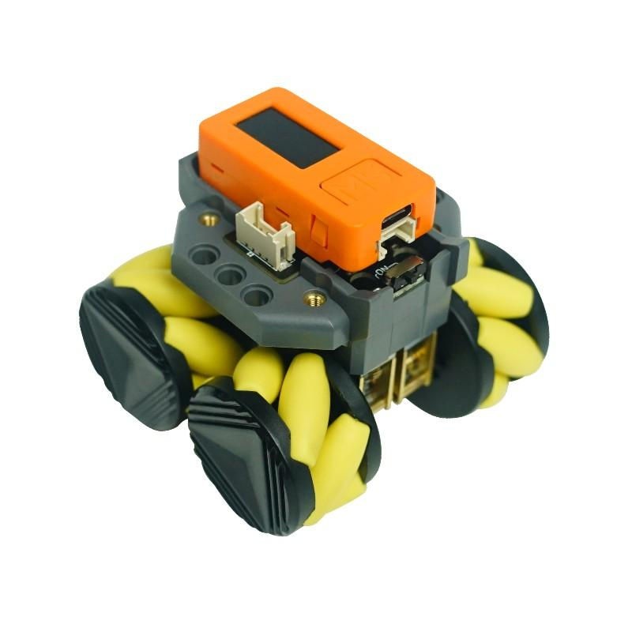
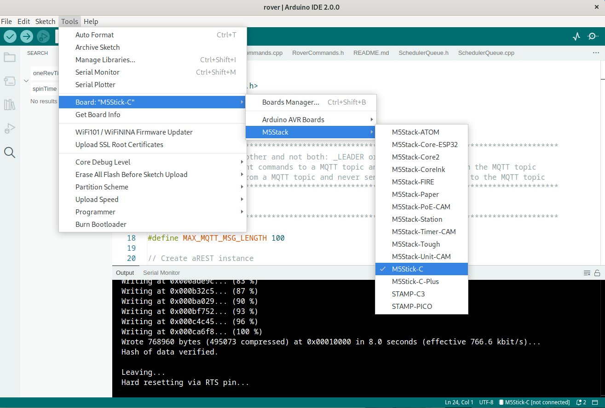
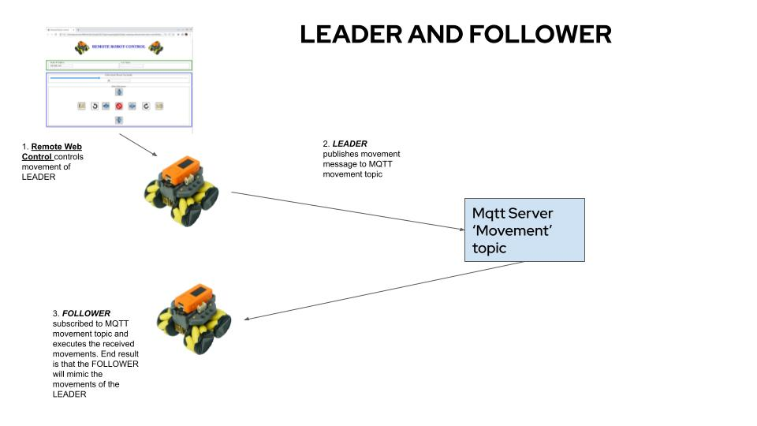

# rover

## 1. Introduction
For our demo, we want robots with the following characteristics:
* small in size ie, easy to carry around
* pre-built and require no bespoke modification
* have Wifi so that they can be controlled over Wifi
* inexpensive
* programmable using Arduino or MicroPython
* with development libraries and examples

## 2. The RoverC Pro Robot
Our requirements are met with the use of 2 components in combination:
* [M5StickC Plus ESP32-PICO Mini IoT Development Kit](https://shop.m5stack.com/collections/m5-controllers/products/m5stickc-plus-esp32-pico-mini-iot-development-kit)

* [RoverC Pro W/O M5StickC](https://shop.m5stack.com/collections/m5-hobby/products/roverc-pro-wo-m5stickc)

This is what the robot looks like after snapping the orange M5StickC Plus Wifi controller onto the RoverC Pro robot base.

The RobotC Pro robot base provides an I2C interface that can be controlled by the M5StickC Plus controller, a dual-core microcontroller with Wifi, which is programmable using Arduino or MicroPython.

## 3. Setting up the Arduino IDE
We are using Arduino to program the M5StickC Plus controller. Description on how to set up the Arduino IDE for M5Stick-C-Plus can be found in the link below:

[Arduino IDE environment - M5StickC Plus](https://docs.m5stack.com/en/quick_start/m5stickc_plus/Arduino-IDE-environment-M5StickC-Plus)

You can find out more about programming the controller at: 
[M5StickC PLUS](https://docs.m5stack.com/en/core/m5stickc_plus)

Once you set up the Arduino following the procedure described in the previous link, you should make one change. From the Arduino IDE:
  Tools->Board, select M5Stick-C and not m5Stick-C-Plus although we are using the M5Stick-C-Plus controller because there are bugs in the board information file that cause errors compiling and loading the Arduino sketch (program) onto the M5StickC. See screenshot below.

 

You have to install the following libraries from the Arduino IDE's Library Manager to compile the rover sketch:
* aRest
* PubSubClient
* ArduinoJson
* ArduionQueue

## 4. The Rover Sketch
The rover sketch consists of the following files:
* rover.ino - the rover sketch. It connects to Wifi, a MQTT server, implements a movement RESTful API for the Remote Robot Control application to control it.
* RoverC.h/RoverC.cpp - header and C Plus PLus files for low-level I2C commands to control the RoverC Pro robot base.
* RoverCommands.h/RoverCommands.cpp - header and C Plus Plus files that implement the high-level robot movement commands.
* SchedulerQueue.h/chedulerQueue.cpp - header and C Plus Plus files that implement an event queue to avoid using the Arduino delay() function which causes laggy remote control responses.

### 4.1 Leader and Follower
The following diagram explains leader and follower.
 

In short, the leader published the movement commands that it receives from the Remote Robot Control application to the 'movement' topic of a MQTT server. The follower subscribes to the 'movement' topic and executes the movements received from the MQTT server. The end result is that the follower mimics the movements of the leader.
  Please note that the leader does not need a follower to function. The leader can be controlled by the Remote Robot Control application without a follower.

### 4.2 Supported Rover Commands
| Movement Command | Description |
| ------------ | ----------- |
| name | Assign a name to the robot. |
| speed | Set the speed of the robot movement in percent top speed. |
|stop | Stop the movement of the robot. |
|forward | Move the robot forward. The robot will continue to move forward until you click on another icon. |
| backward | Move the robot backward. The robot will continue to move backward until you click on another icon. |
| left | Make the robot turn left 10+ degrees and stop. |
| right| Make the robot turn right 10+ degrees and stop. |
|spinLeft | Make the robot spin left 360+ degrees and stop. |
| spinRight | Make the robot spin right 360+ degrees and stop. |
| slideLeft | Make the robot move sideway to the left for a short distance and stop. |
| slideRight | Make the robot move sideway to the right for a short distance and stop. |

### 4.3 Invoking Rover Commands using a RESTful API
A RESTful API has been implemented using the aREST library. The RESTful API to send a robot movement command is of the form:
  http://{robotIP}/exec?param={cmdString}
  where
* robotIP is the IP address of the robot you want to control. It is displayed on the screen of the M5StickC Plus controller.
* cmdString is one of the movement commands. 

For example:
~~~~
http://192.168.1.157/exec?param=forward
~~~~
instructs the robot to move forward
   Another example:
~~~~
http://192.168.1.157/exec?param=speed\&nbsp;40
~~~~
instructs the robot to set the speed to 40% top speed. Note that 40 follows the command 'speed' and a space.
  The Remote Robot Control application uses the encodeURI() function to handle special characters like 'space' by replacing it with '\&nbsp;'.
 
You may use either a GET or a POST operation with the API.

### 4.4 Command Execution Behaviour
It was found that if we use Arduino delay() functions in the sketch for timing, it will make the remote control response unacceptably laggy. Instead, an event processing approach is being used. Whenever a delay is needed, an event will be put in a scheduler queue to be processed when the scheduled time arrives. Control is returned to the Arduino main loop. While a command is waiting for completion, another command can be issued resulting in the abortion of the running command and the near immediate execution of the new command.

### 4.5 Configuration
The rover.ino sketch needs to be configured to match your needs and environment.
 
1. Define if you want the robot to be the leader or follower
 
    ~~~~
    define _LEADER
    //#define _FOLLOWER
    ~~~~
    Select the role by comment out the other. In this case, you want a leader.
2. Configure the Wifi parameters
    ~~~~
    const char* ssid = "Kardinia701";
    const char* password = "myPassword";
    ~~~~
    Change the ssid and password for your Wifi connection.
2. Configure the MQTT server parameters
    ~~~~
    const char* mqttServer = "broker.hivemq.com";
    const int mqttPort = 1883;
    const char* mqttUser = "rhtest";
    const char* mqttPassword = "rhtest";
    ~~~~
    Change the 4 parameters to connect to your MQTT server.