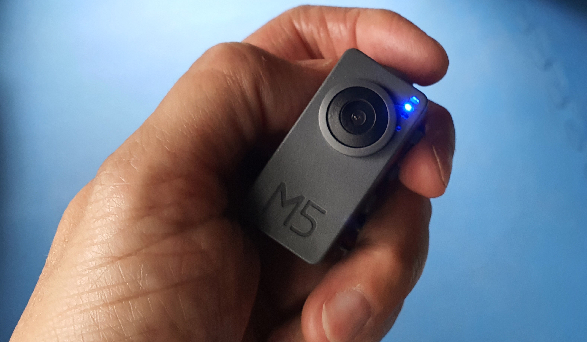
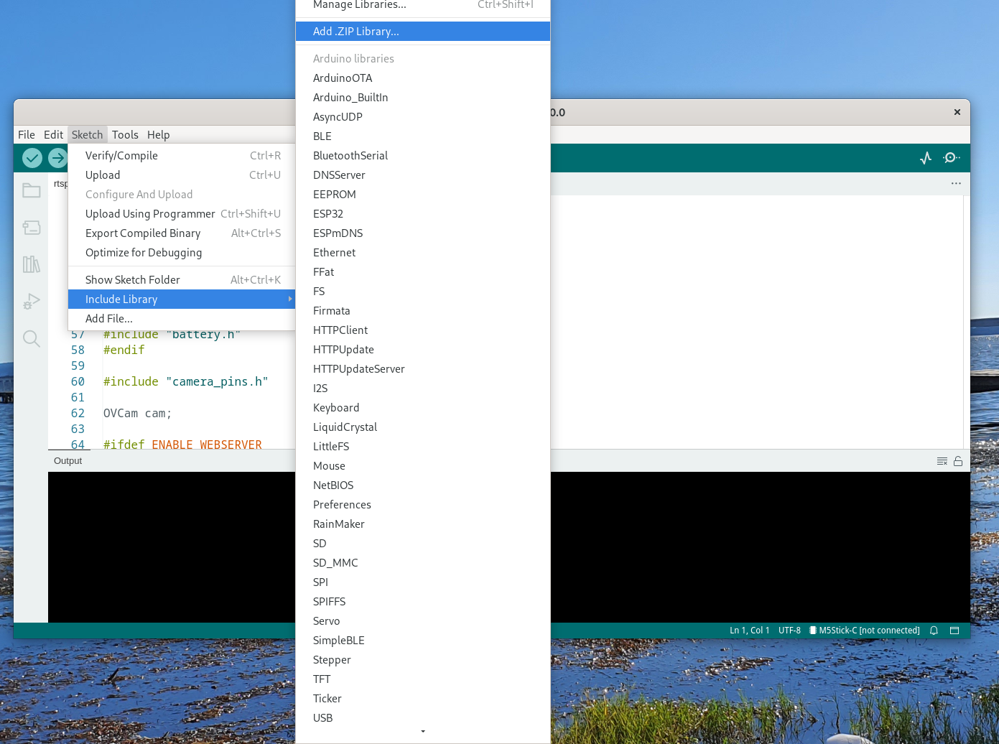
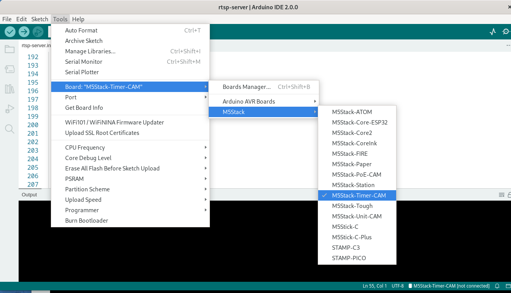
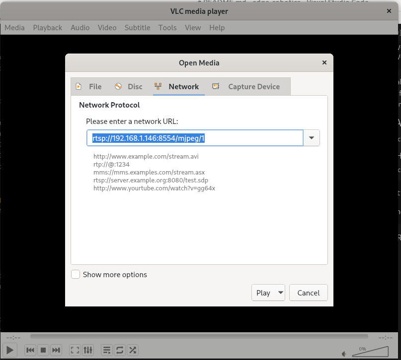
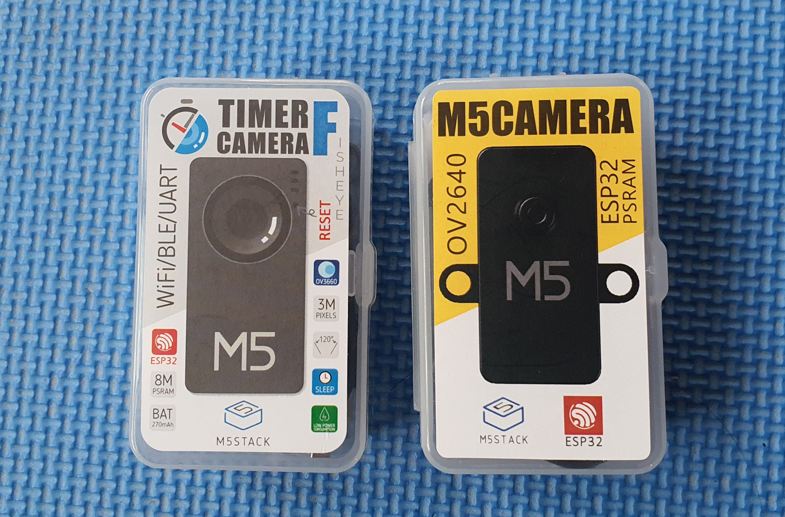

# rtsp-camera

## 1. Introduction
Our project requires a RTSP camera to stream video to be analysed by an AI model running inside a container to detect anomaly. The camera I use is M5StacK's [ESP32 PSRAM Timer Fisheye camera](https://shop.m5stack.com/collections/m5-cameras/products/esp32-psram-timer-camera-fisheye-ov3660) shown below. 

I need to convert this camera into a RTSP server. The code I use is based on **Sander van de Velde**'s article: 
[Turn your M5CAM into a webcam exposing RTSP stream](https://sandervandevelde.wordpress.com/2020/07/02/turn-your-m5cam-into-a-webcam-exposing-rtsp-stream/)
 and his [Github repository](https://github.com/sandervandevelde/rtsp-video-streamer-diy-14) with a number of enhancements.

## 2. Code Enhancements
The RSTP server source code can be found in the 'rstp-server' folder. I added a number of enhancements to make the RTSP camera more useable. They are descibed in their own subsections.

### 2.1 A RESTful API to Power Off the Camera
It is mentioned in the [Camera's documentation](https://docs.m5stack.com/en/unit/timercam_f) 
that:
~~~~
...When in use, the PWR button is used as a power-on button(long press 2s). If you need to shut down the device, you need to use the software API or press the Reset button on the PCB. When using external power supply, the device will remain powered on...
~~~~
It does not mention which software API it is referring to. I need to be able to power off the camera when not in use in a convenient way.
 After doing some research, I found that the above is referring to the
~~~~
bat_disable_output();
~~~~
function in 'battery.h', a part of the [Timer-Cam library](https://www.arduinolibraries.info/libraries/timer-cam).
  I added the following GET RESTful API to poweroff the camera so that I do not have to use a pin to do a reset. 
~~~~
http://serverIP/poweroff

where serverIP is the IP address of the camera.
~~~~

It is more appropriate to use a POST operation but I want to be able to enter it in a browser to power off the camera. Hence a GET has been used instead of a POST.

Please note that you have to download the Timer-Cam library ZIP file available from the link earlier and add it to the Arduino IDE.
~~~~
Sketch->Include Library->Add .ZIP Library
~~~~
and select the .ZIP you downloaded as shown:

 You also need to select the correct board, in out case the 'M5Stack-Timer-Camera' as shown:

### 2.2 A Power Indicator
I want to be able to tell if the camera is on or off by looking at it. The LED on PIN 2 is used as a power indicator. This is the blue LED you see in the photo above.

### 2.3 Renamed Files and Commented Out Dead Code
There are a number of files starting with 'OV2640':
~~~~
OV2640.h
OV2640.cpp
OV2640Streamer.h
OV2640Streamer.cpp
~~~~ 
This is misleading because these files seem to indicate that they only work with the OV2640 camera. Manually examining these file confirms that this is not the case. They only contain high-level hardware-independent camera code. There are no low-level register-based code at all. This is fortunate because our camera uses the OV3660 camera and not the OV2640. I have renamed these files to make it clear that the code is not camera model-specific. 
~~~~
OVCam.h
OVCam.cpp
OVCamStreamer.h
OVCamStreamer.cpp
~~~~ 
I also noticed that Sander's code configures the camera in the sketch (.ino file) and that the multiple camera configurations in the OV2640.cpp are redundant. I removed them.

## 3. Accessing the Video Stream
You can access the stream in two different ways: HTTP and RTSP.

### 3.1 HTTP
You can access the HTTP stream by typing in your browser:
~~~~
http://cameraIP

where cameraIP is the IP address of your camera
~~~~
### 3.2 RTSP
Start VLC, select Media->Open Network Stream... and enter:
~~~~
rtsp://cameraIP:8554/mjpeg/1

where camerIP is the IP address of your camera
~~~~
and click Play. See screenshot below:

## 4. Random Notes
Here are some useful pointers that may help you.

### 4.1 Tested M5 Cameras
I tested two cameras from M5Stack:

If you are using the 'Timer Camera F' (using OV3660) on the left, uncomment the "#define CAMERA_MODEL_M5STACK_PSRAM" and comment out all other cameral models in 'rtsp-server.ino' as shown below:

~~~~
// Select camera model
//#define CAMERA_MODEL_WROVER_KIT
//#define CAMERA_MODEL_ESP_EYE
#define CAMERA_MODEL_M5STACK_PSRAM
//#define CAMERA_MODEL_M5STACK_WIDE
//#define CAMERA_MODEL_AI_THINKER
//#define CAMERA_MODEL_M5CAM
~~~~
If you are using the 'M5Camera' (using OV2640) on the right, uncomment the "#define CAMERA_MODEL_M5STACK_WIDE" and comment out all other cameral models.
~~~~
// Select camera model
//#define CAMERA_MODEL_WROVER_KIT
//#define CAMERA_MODEL_ESP_EYE
//#define CAMERA_MODEL_M5STACK_PSRAM
#define CAMERA_MODEL_M5STACK_WIDE
//#define CAMERA_MODEL_AI_THINKER
//#define CAMERA_MODEL_M5CAM
~~~~
As this camera does not have a battery, the poweroff RESTful API has not been implemented. To power off the camera, press the left button for 10 seconds or more. Or unplug the power source.
  The performance of the two cameras are identical.
  RTSP Stream: 10 FPS at 800 X 600 with a latency of around 2 seconds.
 HTTP Stream:  no noticeable latency.

## 4.2 Powering Off the 'Timer Camera F'
Disconnect the USB cable connecting the camera to a power source and terminate he HTTP stream before issuing the poweroff GET operation or it will fail. This is because the HTTP streaming is single-threaded. If you issue the poweroff command and the blue LED does not turn off, close the browser tab that is accessing the HTTP stream and try again. The blue LED will turn off.

## 4.3 Camera Configuration
The camera configuration is set in the rtsp-server.ino sketch.
~~~~
camera_config_t config;
    config.ledc_channel = LEDC_CHANNEL_0;
    config.ledc_timer = LEDC_TIMER_0;
    config.pin_d0 = Y2_GPIO_NUM;
    config.pin_d1 = Y3_GPIO_NUM;
    config.pin_d2 = Y4_GPIO_NUM;
    config.pin_d3 = Y5_GPIO_NUM;
    config.pin_d4 = Y6_GPIO_NUM;
    config.pin_d5 = Y7_GPIO_NUM;
    config.pin_d6 = Y8_GPIO_NUM;
    config.pin_d7 = Y9_GPIO_NUM;
    config.pin_xclk = XCLK_GPIO_NUM;
    config.pin_pclk = PCLK_GPIO_NUM;
    config.pin_vsync = VSYNC_GPIO_NUM;
    config.pin_href = HREF_GPIO_NUM;
    config.pin_sscb_sda = SIOD_GPIO_NUM;
    config.pin_sscb_scl = SIOC_GPIO_NUM;
    config.pin_pwdn = PWDN_GPIO_NUM;
    config.pin_reset = RESET_GPIO_NUM;
    config.xclk_freq_hz = 10000000;
    config.pixel_format = PIXFORMAT_JPEG;
    config.frame_size = FRAMESIZE_SVGA;
    config.jpeg_quality = 25; 
    config.fb_count = 2;
~~~~
The PIXFORMAT (video resolution) can be one of the following:
~~~~
    FRAMESIZE_QQVGA,    // 160x120
    FRAMESIZE_QQVGA2,   // 128x160
    FRAMESIZE_QCIF,     // 176x144
    FRAMESIZE_HQVGA,    // 240x176
    FRAMESIZE_QVGA,     // 320x240
    FRAMESIZE_CIF,      // 400x296
    FRAMESIZE_VGA,      // 640x480
    FRAMESIZE_SVGA,     // 800x600
    FRAMESIZE_XGA,      // 1024x768
    FRAMESIZE_SXGA,     // 1280x1024
    FRAMESIZE_UXGA,     // 1600x1200
    FRAMESIZE_QXGA,     // 2048*1536
    FRAMESIZE_INVALID
~~~~
Pin numbers are specific to a particular camera.