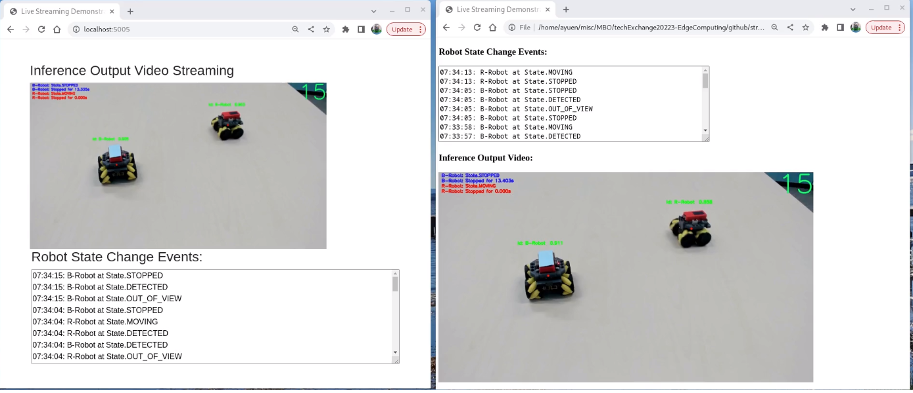

# Edge Robotics AI/ML Demo

This is the repositiory for the Edge based Robotics AI/ML Demo. This architecture diagram depicts the currently proposed architecture. The solution is evolving and this will certainly change.

And here is a screenshot of running two instances of our Robots Demo at the same time.

# Objectives
This project is not just about building an AI model to recognise robots and determining whether they are moving or have stopped over 2 seconds It is also about the following topics:
* Onboarding edge devices with strong authentication using FIDO
* Red Hat OpenShift Data Science (RHODS)
* One-click setup of infrastructure and demo
* ML-OPs using Tekton and Argo CD
* Container technologies including podman, OpenShift, MicroShift and Kubernetes
* hybrid cloud/multi cloud
* ...

## Folders

***New folders and contents inside the folders are being continuously updated as new requirements and use cases are added. The description below will be outdated quickly.***

- [Arduino](https://github.com/odh-labs/edge-robotics/tree/main/Arduino) - contains two projects: 1) programmable-robot: the robot control sketch for our chosen programmable robot for the demo. And 2)
rstp-camera: the sketch to make our chosen camera into a RTSP server for streaming videos.
- [Demos](https://github.com/odh-labs/edge-robotics/tree/main/demos) - with various video recordings, not yet ready for YouTube. [DEMO-LISTING.md](https://github.com/odh-labs/edge-robotics/blob/main/demos/_DEMO-LISTING.md) has more details
- [java-api-accept-image](https://github.com/odh-labs/edge-robotics/tree/main/java-api-accept-image) - a Spring Boot based API that accepts an image and saves that image to disk
- [mosquitto-running-on-microshift](https://github.com/odh-labs/edge-robotics/tree/main/mosquitto-running-on-microshift) - documented procedure for installing MicroShift on bare-metal and provided an image for deploying the Eclipse Mosquitto MQTT server with the proper configuration on quay.io together with a description on deploying it on MicroShift using the provided deplyment.yaml file.
- [remote-robot-control](https://github.com/odh-labs/edge-robotics/tree/main/remote-robot-control) - a web-based remote robot control Javascript application for controlling the robot using the robot's RESTful API.
- [model](https://github.com/odh-labs/edge-robotics/tree/main/model) - wrap the trained model in flask api and deploy it on openshift
- [Application](https://github.com/odh-labs/edge-robotics/tree/main/Application) - Deploys the model+UI provided by guiseAI to Openshift using a Dockerfile
- [Edge Hardware](https://github.com/odh-labs/edge-robotics/tree/main/edge-hardware) - Sets up bare metal edge devices via FDO and PXE Boot
