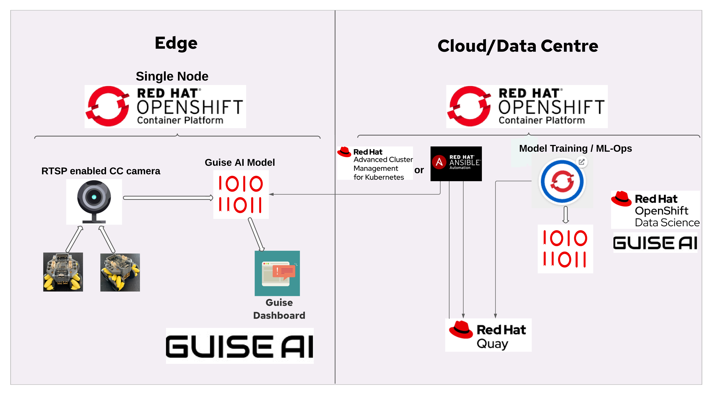

# Edge Robotics AI/ML Demo

This is the repositiory for the Edge based Robotics AI/ML Demo. This architecture diagram depicts the currently proposed architecture. The solution is evolving and this will certainly change.

## Folders

- [Arduino](https://github.com/odh-labs/edge-robotics/tree/main/Arduino) - contains two projects: 1) programmable-robot: the robot control sketch for our chosen programmable robot for the demo. And 2)
rstp-camera: the sketch to make our chosen camera into a RTSP server for streaming videos.
- [Demos](https://github.com/odh-labs/edge-robotics/tree/main/demos) - with various video recordings, not yet ready for YouTube. [DEMO-LISTING.md](https://github.com/odh-labs/edge-robotics/blob/main/demos/_DEMO-LISTING.md) has more details
- [java-api-accept-image](https://github.com/odh-labs/edge-robotics/tree/main/java-api-accept-image) - a Spring Boot based API that accepts an image and saves that image to disk
- [mosquitto-running-on-microshift](https://github.com/odh-labs/edge-robotics/tree/main/mosquitto-running-on-microshift) - documented procedure for installing MicroShift on bare-metal and provided an image for deploying the Eclipse Mosquitto MQTT server with the proper configuration on quay.io together with a description on deploying it on MicroShift using the provided deplyment.yaml file.
- [remote-robot-control](https://github.com/odh-labs/edge-robotics/tree/main/remote-robot-control) - a web-based remote robot control Javascript application for controlling the robot using the robot's RESTful API.