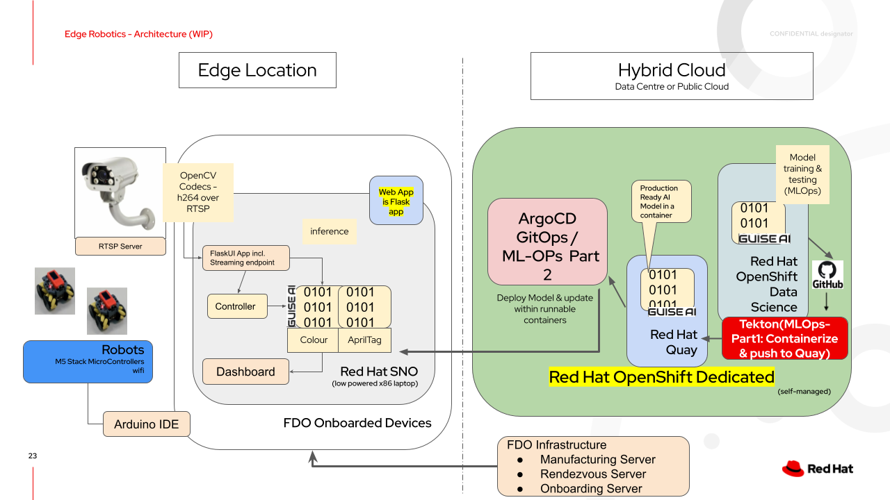

# Edge Robotics AI/ML Demo

This is the repositiory for the Edge based Robotics AI/ML Demo. This architecture diagram depicts the currently proosed architecture. The solution is evolving and this will certainly change.

## Folders

- [Arduino, the IDE and its coe for programming and controlling the robots](https://github.com/odh-labs/edge-robotics/tree/main/Arduino)
- 