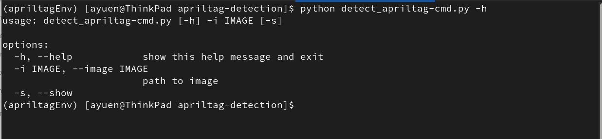

# AprilTag Dection

## 1. Introduction
AprilTag was designed by the University of Michigan for use in augmented reality, robotics, camera calibration, etc. According to its
[home page](https://april.eecs.umich.edu/software/apriltag)
~~~~
...AprilTag is a visual fiducial system, useful for a wide variety of tasks including augmented reality, robotics, and camera calibration. Targets can be created from an ordinary printer, and the AprilTag detection software computes the precise 3D position, orientation, and identity of the tags relative to the camera. The AprilTag library is implemented in C with no external dependencies. It is designed to be easily included in other applications, as well as be portable to embedded devices. Real-time performance can be achieved even on cell-phone grade processors...
~~~~
AprilTags are lke QR Codes but they contain much less data than QR Codes. AprilTags' strength is that they allow for very fast detection and processing. The detector can detect an AprilTag from different angles. And we do not need to train an AI model like we did (see the 'model' folder) before it can idnetify robots. 
 There are several familiies of AprilTags. The family we are using is the 'Tag36h11' ie, it can contain 36 bits of data and has a hamming distance of 11 (error correction).
We are using AprilTags to identify robots and their location in an image. For a quick test, we attached an AprilTag on top of a robot using bluetag.

## 2. Installing AprilTag
We are using Python to write the detector. Before you 'pip install' the requirement.txt file, you need to first install the C/C++ Development Environment on you system. This is because an apriltag wheel will be created from source code for installation. To install the C/C++ Development Environment, issue the following commands from a Terminal window:
~~~~
# on Fedora-based OSes
sudo dnf group install "C Development Tools and Libraries" "Development Tools"

# on Debian-based OSes
sudo apt-get update && apt-get install build-essential cmake ffmpeg libsm6 libxext6 -y
~~~~

Then, you create a virual environment and install the dependent Python packages:

~~~~
# create virtual environment
python3 -m venv path/apriltagEnv

# activate virtual env apriltagEnv
source path/apriltagEnv/bin/activate

# cd to directory where the requirements.txt file resides and
# install dependent packages
pip install -r requirements.txt

~~~~
where path is the path to the newly created apriltagEnv (folder).

## 3. Running the AprilTag Detector
To run the AprilTag detector (detect_apriltag-cmd.py), you must run it from a Terminal with the apriltagEnv virtual environment activated. This is shown with '(apriltagEnv) on the left of your command prompt:

~~~~
# the following command shows the centre of the
# detected AprilTag enclosed in a box and
# the tag ID
python detect_apriltag-cmd.py --image test-images/1024_test011.jpg -s
~~~~

Running the same command without the -s option, saves the images in the current directory with a '_' prepended to the file name. In this case: _1024_test011.jpg

## 4. Spreadsheet for AprilTag Size Estimation
We have included a spreadsheet (EstimateApriltagSize.xlsx) to help you estimate the size of the AprilTag you need for your application for consistent detection. It is for reference only. You still need to test it out. You can modify the input parameters to suit you use case.

## 5. Building a REST API for AprilTag Detection
For a descption on this, please go to the 'rest-api' folder.