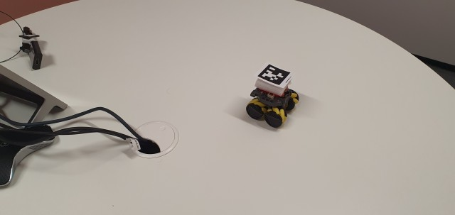

# AprilTag Dection REST API

## 1. Introduction
We are going to show you how to build a container image to expose a REST API to detect AprilTags. You must have either podman or docker installed on your system as a prerequisite.

## 2. Build the Container Image
From a Terminal window, change to the directory containing the Dockerfile and issue the following command:

~~~~
podman build -t apriltag-detect .
~~~~

If you are using docker, replace 'podman' with 'docker'
 The following command will list the images on your system.
~~~~
podman images
~~~~

And you should see something like:
~~~~
podman images
REPOSITORY                           TAG         IMAGE ID      CREATED        SIZE
localhost/apriltag-detect            latest      a92338867913  27 hours ago   1.18 GB

~~~~
although you may have more entries displayed.

## 3. Running the Image
To run the image in a container, issue the following command from a Terminal window:
~~~~
podman run --rm --name apriltag -p 6000:6000 localhost/apriltag-detect
~~~~
To detect AprilTags in an image, run the following command:
~~~~
curl --location --request POST \
'http://localhost:6000/v1/object-detection/apriltag' \
--form 'image=@'"test-images/640_test011.jpg" | python -m json.tool
~~~~
The beautified JSON output looks like:
~~~~
[
    {
        "center": [
            385,
            105
        ],
        "corners": [
            [
                362,
                108
            ],
            [
                379,
                91
            ],
            [
                408,
                103
            ],
            [
                392,
                120
            ]
        ],
        "decision_margin": 76.10092163085938,
        "goodness": 0.0,
        "hamming": 0,
        "homography": [
            [
                0.7755603665304363,
                0.4629305558682512,
                19.129149277600167
            ],
            [
                -0.3229300835730634,
                0.22556818724695923,
                5.219566580732711
            ],
            [
                0.0009646816294368872,
                -0.0007435265870446799,
                0.04965672865286817
            ]
        ],
        "tag_family": "b'tag36h11'",
        "tag_id": 0
    }
]
~~~~

The only info needed for our use case is the tag_id which identifies the robot and the centre of the detected AprilTag. By tracking the centre from frame to frame, we will know when the robot stops and for how long. By using the tag_id, we know if the robot is in the image or not as we know the Tag_id for all our robots.
 The image (test-images/640_test011.jpg)only has one robot with an AprilTag in it.

If there were more such robots with different AprilTags, and if they were detected, the JSON output would have contained all detected AprilTag information.
The other info returned eg, homography is used in more advanced robotic applications such as pose estimation, camera calibration and we are not going to discuss it here
