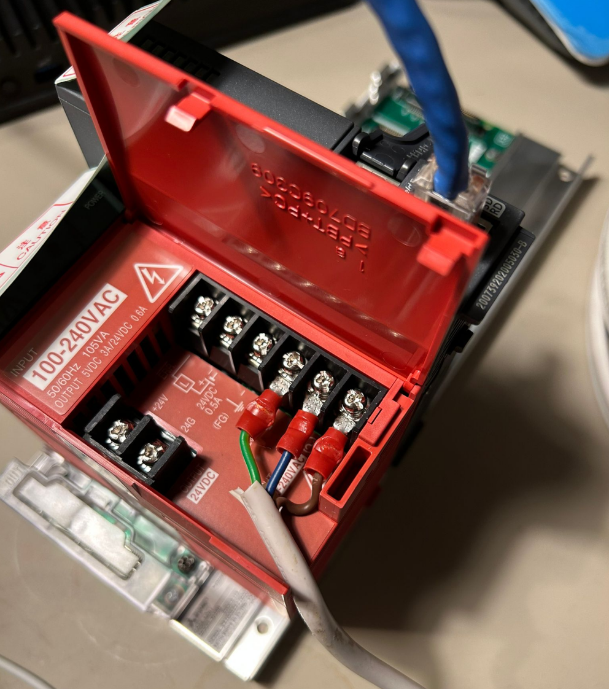
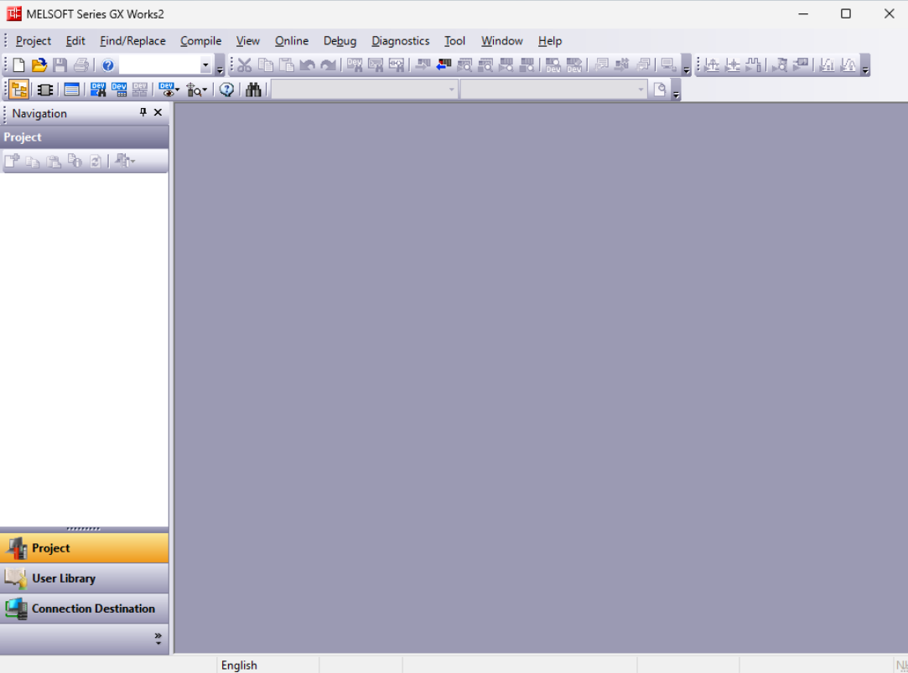
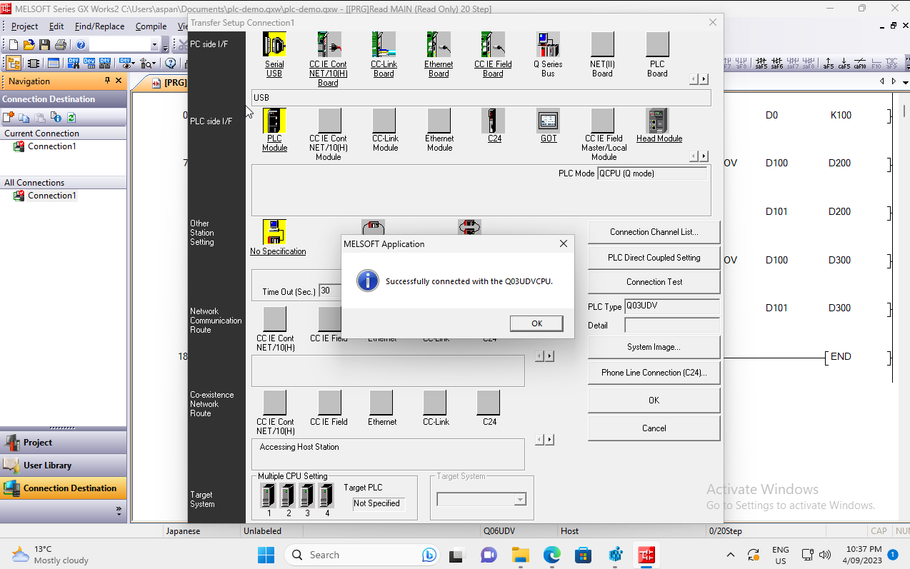

This file describes the order, installation, wiring and software configuration process to have the Mitsubishi MELSEC PLC running.
The 2nd part of this document describes how to connect the MELSEC PLC with the Takebishi DeviceGateway (dgw) on OpenShift.

## ORDERING
I ordered the 3 necessary parts at the Amazon Japan website:

1. Power Supply, Base Unit, CPU Unit:
Power Unit
https://amzn.asia/d/doHS3DC

Base Unit
https://amzn.asia/d/8xn6s8J

CPU Unit
https://amzn.asia/d/4StJQIC

The actual PLC (CPU Unit) is the most expensive one. I ordered a 'like new' model which was roughly Y20,000 cheaper than a brand new one.

## WIRING
Once the power supply and PLC are plugged into the base unit you need to wire up the power-supply and connect to a 220V/50Hz live-wire power supply!
In Australia  you need a licencsed electrition to do this work.

## Configuration
You need the Mitsubishi GXWorks2 application, which is only available on Windows.
- Hence step #1 is to get your Windows 11 operating system installed.
- Then Download GXWorks2, setup your account and then configure the windows applications.
You can directly search for the trial version of GX Works2.
Or download it from here:
https://www.mitsubishifa.co.th/en/Software-Detail.php?id=MTE=&vs=trial
I've used Version 1.600A from December 2020
Link address: https://www.mitsubishifa.co.th/files/dl/sw1dnd-gxw2-e_1.600a_t.zip

- You will need .NET 3.5 installed.
In order to do that go to the search bar and type in 'Windows Features'.
This will lead to a 'Turn Windows features on or off' dialog -> Select .NET Framework 3.5 (includes.NET 2.0 and 3.0)

- Then extract the installer.zip and double-click the setup.exe for GX Works2 which will trigger the Install Shield Wizard to kick-off the installation.

Assuming everything went well you will end up with the MELSOFT Series GX Works2 program running on your Windows 11 box:

## Quick Start Guide for the first time user which is unfortunately based on GX Developer so unusable for our scenario.
GXDeveloper version, English: https://dl.mitsubishielectric.co.jp/dl/fa/document/catalog/plcq/l08139e/l08139eb.pdf
GX Works2 version, Japanese: https://dl.mitsubishielectric.co.jp/dl/fa/document/catalog/plcq/l08138/l08138d.pdf

To reproduce the following flow do the following:
- Connect the PLC CPU module via USB to your Windows 11 system (bare metal or Virtual Machine (ensure you have USB passthrough configured)
- Import the demo project, via File >> Open
- Click on 'Connection Desitination' and double click on Connection1.
- click 'Connection Test'
If everything goes according to plan you should see the following 'Successfully connected with the Q03UDVCPU' message

