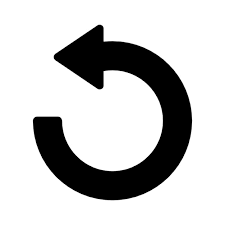

# remote-robot-control

## 1. Introduction
This is a web-based remote robot control javascript application. The robot it controls is a pre-assembled robot that only requires snapping the Wifi controller and the robot base together.

The specifications of the two components making up the robot are shown in the following links:

[M5StickC Plus ESP32-PICO Mini IoT Development Kit](https://shop.m5stack.com/collections/m5-controllers/products/m5stickc-plus-esp32-pico-mini-iot-development-kit)

[RoverC Pro W/O M5StickC](https://shop.m5stack.com/collections/m5-hobby/products/roverc-prow-o-m5stickc)

This is what the robot looks like after connected to the Wifi network and recevied the 'slideRight' movement command.

Information on the programming of this robot to provide a RESTful API to this control program can be found in the 'Arduino' directory of the 'edge-robotics' project/repository.

## 2. Running this Application
This is a web page that runs on your laptop's browser. You must connect your laptop to the same private network which the robot is connected to.

To start the application, use the FileManager, or equivalent, to navigate to the "remote-robot-control' directory of your cloned 'edge-robotics' project, select the index.html file and open it in your browser. No installation or web server is required.

 

## 3. Controlling the Robot
| Control Functions | Description |
| ------------ | ----------- |
| Robot IP Address | Enter the IP address of the robot you want to control. The IP address of the robot is displayed on the screen of the orange controller on top of the robot base. |
| Robot Speed Slider | Move the slider to adjust the speed of the robot in percent top speed. As you move the slider, its value will be displayed in the read-only textbox. |
| | Move the robot forward. The robot will continue to move forward until you click on another icon. |
| | Move the robot backward. The robot will continue to move backward until you click on another icon. |
| | Make the robot turn left 10+ degrees and stop. |
| | Make the robot turn right 10+ degrees and stop. |
| | Stop the movement of the robot. |
| | Make the robot spin left 360+ degrees and stop. |
| | Make the robot spin right 360+ degrees and stop. |
| | Make the robot move sideway to the left for a short distance and stop. |
| | Make the robot move sideway to the right for a short distance and stop. |